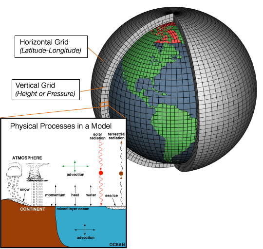
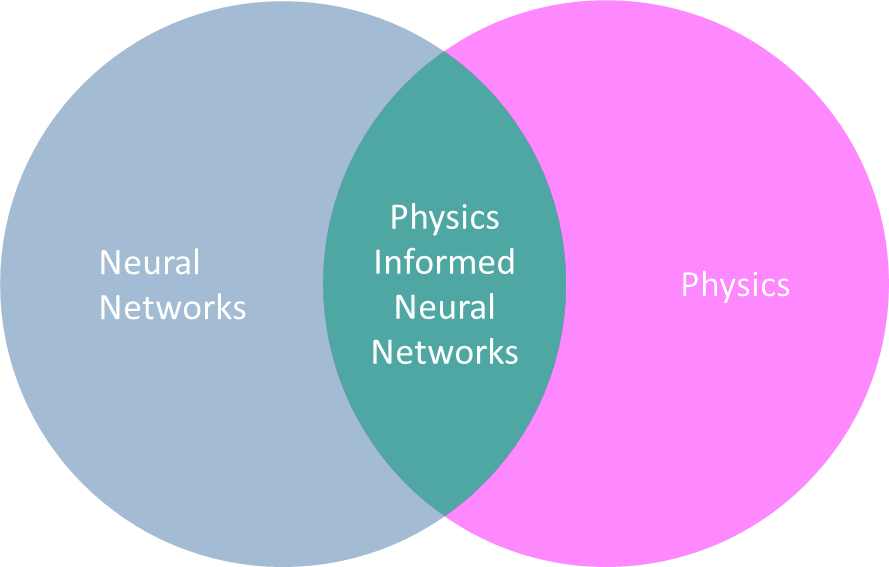
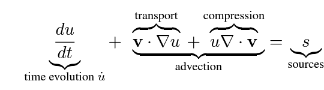
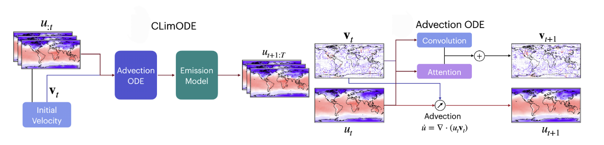
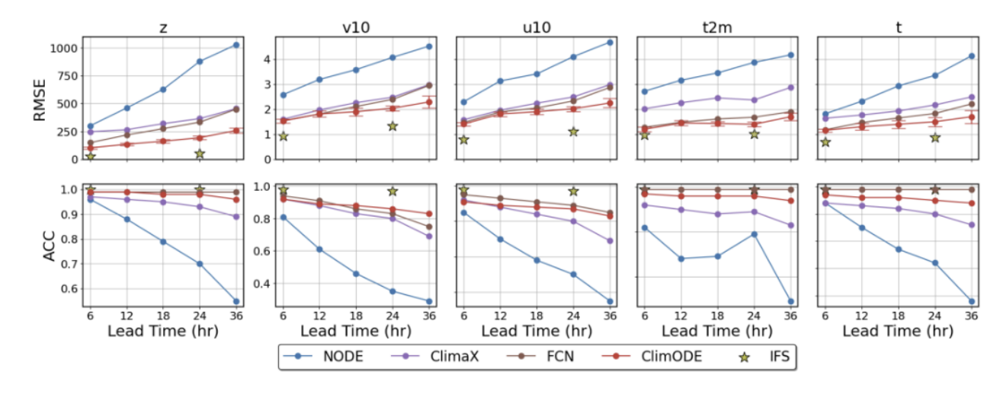
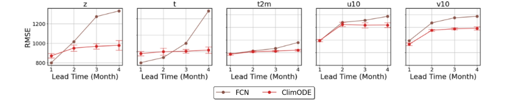

<!-- ## Introduction -->
Weather forecasting is an essential aspect of modern life, influencing decisions on both personal and global scales. From planning a simple outdoor activity to issuing critical warnings for natural disasters like storms and heatwaves, accurate weather predictions are indispensable. Farmers rely on forecasts to optimize agricultural strategies, and industries such as aviation, logistics, and energy depend on reliable weather models for efficient operations.

Traditionally, weather forecasting has been driven by complex physical simulations, which, while accurate, require immense computational resources. In contrast, deep learning models offer a more data-driven approach but often act as black boxes, failing to incorporate fundamental physical laws that govern weather dynamics.

This blog explores **ClimODE**, a novel climate and weather forecasting model that bridges the gap between traditional numerical methods and deep learning. By integrating physics-based constraints with deep learning techniques, ClimODE offers a computationally efficient and physically consistent approach to long-term weather and climate prediction.

## Background and Challenges
### The Traditional Approaches

Traditional weather prediction primarily relies on Numerical Weather Prediction (NWP) models, which use physics-based simulations to forecast future weather conditions. By solving complex equations governing atmospheric dynamics, these models provide highly accurate short- to medium-range forecasts.

Despite their effectiveness, NWP models come with significant challenges. One of the biggest drawbacks is computational cost. High-fidelity simulations require immense computing power, often relying on supercomputers to run effectively. Additionally, sensitivity to initial conditions poses a fundamental limitation. Small errors in the initial weather state can grow exponentially, leading to inaccurate long-term forecasts. As a result, reliable forecasting is typically limited to about six days, beyond which predictions become increasingly uncertain.

  
   
  <em style="color: grey;">Figure: Traditional weather models simulate atmospheric dynamics using physics-based equations on a 3D grid, where complex equations are solved for each grid cell, along with calculations for interactions with neighboring cells. </em>

### Why Deep Learning?
Deep learning has emerged as a promising alternative to traditional Numerical Weather Prediction (NWP) models by learning patterns from historical weather data rather than explicitly solving complex physics equations. This approach significantly reduces computational costs, making them more scalable and efficient. Additionally, these models excel at capturing intricate relationships between weather variables, leveraging vast datasets to uncover patterns and correlations.

Several deep learning models have been developed for weather and climate prediction, each leveraging different architectures to enhance forecasting capabilities. **FourCastNet**, a Fourier-based neural network model, specializes in global weather forecasting. **ClimaX**, a transformer-based model, is designed for climate modeling and general-purpose weather forecasting. **Pangu-Weather**, another deep learning-based model, utilizes 3D Earth-specific transformer networks to achieve high-resolution predictions. 

While these models demonstrate the potential of deep learning in weather forecasting, they still suffer from key limitations. Many function as black-box models, making it difficult to interpret how they generate predictions. Additionally, most data-driven models do not explicitly incorporate physical constraints, leading to physically inconsistent or unrealistic forecasts. Another major drawback is uncertainty estimation—most deep learning approaches do not quantify uncertainty, making it difficult to assess the reliability of predictions. 

These limitations highlight the need for hybrid approaches that integrate deep learning with physics-based constraints, paving the way for **Physics-Informed Neural Networks (PINNs)**.

  
   
  <em style="color: grey;">Figure: The intersection of Physics and Neural Networks gives rise to Physics-Informed Neural Networks (PINNs), combining the interpretability of physics-based models with the efficiency of neural networks.</em>

## ClimODE

### Overview

ClimODE presents a novel approach to weather forecasting by combining the strengths of deep learning with foundational principles of physics. Unlike traditional numerical weather prediction methods that rely on computationally expensive partial differential equations (PDEs), ClimODE employs a more efficient framework by converting these PDEs into first-order ordinary differential equations (ODEs). This simplification reduces computational cost while maintaining accuracy, enabling scalable and stable long-term forecasting.

ClimODE also addresses the limitations of purely data-driven deep learning models, which often act as black boxes and lack physical consistency. By integrating real-world physics into its design, ClimODE ensures adherence to key principles such as conservation of mass and the continuity of weather variables, providing interpretable and reliable predictions. Moreover, the model captures the continuous and smooth nature of weather as a spatiotemporal process, avoiding errors that arise when weather variables are treated as discrete states.

### Core Methodology

As per statistical mechanics, weather can be seen as a spatial movement of quantities over time governed by the partial differential equation continuity equation.

  
   
  <em style="color: grey;">Figure: Continuity Equation</em>

ClimODE transforms the continuity equation into a physics-informed neural network by breaking it down into dedicated components, each handling a specific term of the equation:

- **Time Evolution**: This term represents how weather variables like temperature and humidity evolve over time. ClimODE captures this evolution through the Flow Velocity Model, which predicts the speed and direction of weather variable movement.
  
- **Advection**: This term describes the transport and compression of weather variables due to fluid motion, such as wind. ClimODE models this through the Advection ODE Model, ensuring the smooth spatiotemporal flow of weather variables across regions.

- **External Sources**: This term accounts for external factors like energy variations caused by the day-night cycle or seasonal effects. ClimODE handles this through the Emission Model, which incorporates bias and variance to capture systematic deviations and uncertainties.

#### Flow Velocity Model:

ClimODE uses a neural network to model the velocity field (v) and predict how weather variables (like temperature, pressure, etc.) evolve with time. The flow velocity model determines where and how fast weather variables move, essentially the speed and the direction. The model uses the current weather states, gradients that capture how the variables change spatially, and Spatiotemporal embeddings, which incorporate geographical and temporal information, such as latitude, longitude, time, and seasonal context, to predict the same.

ClimODE leverages local convolutions and global attention mechanisms to capture the full spectrum of weather dynamics from local small-scale weather patterns to global-scale weather interactions. The global attention component enables the model to understand large-scale weather interactions, such as El Niño, a climate phenomenon originating in the Pacific Ocean that influences weather globally, causing droughts in Australia and heavy rainfall in South America. Simultaneously, local convolutions allow ClimODE to model small-scale patterns, such as sea breeze circulation in coastal areas, where temperature differences between land and sea drive localized wind patterns. These interactions affect rainfall, temperature, and air quality in nearby regions. By addressing both global and local phenomena, ClimODE provides a comprehensive framework for accurate weather prediction.

#### Advection Model:

At the core of the partial differential equations that model how weather evolves continuously in both time and space is the advection principle. This principle describes how weather variables, such as temperature and humidity, are transported through a fluid, like the atmosphere, due to its motion. In simpler terms, advection captures how these variables are carried by wind and flow across time and space.

Advection consists of two essential components: transport and compression. Transport tracks the movement of weather variables through the atmosphere, such as warm air shifting from one region to another due to wind. Compression, on the other hand, reflects changes in these variables caused by forces like convergence, where air flows into a region, or divergence, where it flows out. This process plays a vital role in phenomena like cloud formation and shifts in atmospheric pressure.

By explicitly integrating the physics of advection into its framework, ClimODE ensures adherence to the fundamental principles governing weather phenomena. It assumes the entire system to be a closed one that abides by the laws of conservation, meaning the total quantities of weather variables, such as temperature, remain constant and are neither created nor destroyed. This adherence to real-world physics not only enhances long-term forecasting stability but also prevents collapses in forecasts over extended time horizons, ensuring consistency with physical laws.

#### Emission Model:

If we limit weather modeling to the previously discussed components, two main problems emerge. First, the system is assumed to be deterministic, failing to account for uncertainties that can arise from various sources, such as unpredictable weather events or micro-scale dynamics. Second, the system is treated as closed, which does not allow for value changes like those caused by day-night cycles. To address these issues, ClimODE incorporates an additional step in its pipeline: the emission model.

The emission model outputs two key elements: bias and variance. The bias captures systematic deviations in the model, such as predictable changes during day-night cycles, and corrects for these deviations to enhance prediction accuracy. Meanwhile, the variance quantifies the uncertainty in weather predictions. This includes aleatoric uncertainty, which stems from the inherent randomness of weather systems, such as sudden storms or small-scale turbulence, as well as epistemic uncertainty, which arises from limitations in the model’s knowledge or data, such as insufficient observations. By explicitly modeling these uncertainties, ClimODE makes its predictions more robust and reliable in real-world scenarios.

  
   
  <em style="color: grey;">Figure: The full ClimODE pipeline</em>

### Other Contributions

#### PDE-to-ODE Conversion

One of the key contributions of ClimODE is its ability to simplify the traditionally complex numerical weather prediction pipeline. Conventional methods rely on solving computationally intensive partial differential equations (PDEs) to simulate weather patterns. In contrast, ClimODE applies methods discussed in prior research (Schiesser, 2012; Iakovlev et al., 2021) to reformulate these PDEs as a system of first-order ordinary differential equations (ODEs). This transformation drastically reduces computational costs, making weather forecasting scalable and accessible without sacrificing accuracy. Using numerical solvers like Runge-Kutta, ClimODE handles the reduced ODE system efficiently, offering a computational advantage while staying true to the underlying physics.

#### Modeling Weather as a Continuous Spatio-Temporal System

ClimODE treats weather as a continuously evolving spatio-temporal system, aligning more closely with real-world dynamics. This approach ensures that variables such as temperature and humidity transition smoothly over time and space, avoiding abrupt, unrealistic changes that may arise from discretized modeling methods. By capturing this smooth evolution, ClimODE enhances the realism and accuracy of its forecasts.

#### Initial Velocity Inference

One critical step in ClimODE's framework is the estimation of initial velocities, which are required to start solving the system of Ordinary Differential Equations (ODEs). Traditionally, estimating velocity in dynamic systems is a challenging inverse problem that often requires complex encoders or approximations. However, ClimODE innovatively uses the continuity equation to directly infer these velocities. By framing it as an optimization problem, ClimODE ensures accurate and spatially consistent initial velocities, enabling it to effectively solve the governing equations while adhering to physical principles and maintaining computational efficiency.

## Experiments

### Benchmarking Models

ClimODE was benchmarked against state-of-the-art models, including ClimaX, a transformer-based model designed for weather and climate science, and FourCastNet, a data-driven weather forecasting model leveraging Fourier transforms. The model was also compared against a NeuralODE and the state-of-the-art Integrated Forecasting System (IFS), which is widely regarded as the gold standard in weather forecasting. While IFS is computationally expensive, it serves as a critical benchmark for measuring the accuracy of models. IFS is a numerical weather prediction (NWP) model and represents one of the most advanced global physics simulation systems.

### Evaluation Metrics

Performance comparisons were conducted using two primary evaluation metrics: Latitude-weighted Root Mean Square Error (RMSE) and Anomaly Correlation Coefficient (ACC). The Latitude-weighted RMSE, a modified version of the standard RMSE, accounts for the Earth's curvature by weighting errors based on latitude. This adjustment ensures that grids near the poles, which have a smaller surface area, do not disproportionately influence the overall result. On the other hand, ACC measures the model's ability to detect deviations from normal weather conditions. A higher ACC score reflects good performance in identifying and forecasting these deviations, which is critical for reliable and effective weather prediction.

### Dataset

ClimODE was trained and evaluated using a preprocessed ERA5 dataset, sourced from WeatherBench. The dataset contains meteorological variables at a resolution of 5.625° and spans 6-hour increments for precise temporal modeling. 

The following five key meteorological variables were considered:
- Ground temperature (t2m)
- Atmospheric temperature (t)
- Geopotential (z)
- Ground wind vectors (u10, v10)

The dataset was divided into distinct segments for training, validation, and testing purposes. Data from 2006 to 2015 was allocated for training the model, while the year 2016 was used for validation. The remaining years, 2017 and 2018, were reserved for testing to evaluate the model's performance on unseen data.

## Results

### Global Forecasting

ClimODE demonstrates remarkable performance in global weather forecasting, particularly in predicting crucial meteorological variables such as ground temperature, atmospheric temperature, and wind vectors. When benchmarked against other neural methods, ClimODE consistently outperforms them across evaluation metrics, showcasing the effectiveness of integrating a physics-informed approach into its architecture.

However, when compared to the gold-standard IFS, ClimODE falls short in overall accuracy. This is expected, as IFS is a highly advanced numerical weather prediction model with extensive computational resources dedicated to solving partial differential equations. Despite this gap, ClimODE proves its merit by offering a computationally efficient alternative while maintaining physical consistency in its predictions.

Additionally, ClimODE’s predictions are further validated through metrics such as Continuous Ranked Probability Score (CRPS), which highlights its ability to generate probabilistic forecasts that align closely with observed data. These results underscore the significance of incorporating physical principles for advancing weather modeling and long-term global forecasting.

  
   
  <em style="color: grey;">Figure: Performance comparison of ClimODE and baseline models for RMSE and ACC metrics.</em>

### Local Forecasting

For Local Forecasting, ClimODE's capability in regional weather prediction has been evaluated over specific bounding regions, namely North America, South America, and Australia. These regions were chosen due to their diverse meteorological characteristics, making them a challenging and meaningful test for regional weather forecasting.

The results reveal that ClimODE performs exceptionally well in forecasting key meteorological variables such as ground temperature (t2m), atmospheric temperature (t), and geopotential height (z). Additionally, it maintains competitive performance in predicting wind vectors (u10, v10). This showcases ClimODE’s proficiency in modeling the finer-scale, localized weather dynamics that are critical for regional predictions.

### Climate Forecasting

Climate forecasting involves extended weather prediction over longer durations, for example spanning weeks or months. It aims to capture and predict average weather conditions over defined periods. ClimODE was evaluated for its climate forecasting capabilities by predicting monthly averages of key meteorological variables using the ERA5 dataset. For a fair comparison, the same dataset, variables, and hyperparameters were used.

Comparative analysis was done with FourCastNet, a data-driven model, which showed ClimODE's superior performance in predicting monthly averages, as demonstrated by metrics like Latitude-weighted RMSE and Anomaly Correlation Coefficient (ACC). ClimODE effectively captured long-term climate patterns with improved accuracy, highlighting its efficacy in climate forecasting along with short-term weather predictions.

  
   
  <em style="color: grey;">Figure: Monthly Forecasting Results: Performance of ClimODE vs. FCN across key meteorological variables over different lead times. ClimODE outperforming FCN, especially for extended lead times</em>

## Limitations and Future Work
While ClimODE demonstrates impressive performance in weather prediction, it does have certain limitations. One notable drawback is that its accuracy still falls short compared to gold-standard numerical weather prediction models such as the Integrated Forecasting System (IFS). Additionally, ClimODE's evaluation has been geographically limited to regions like North America, South America, and Australia, leaving its performance in other areas, such as Europe and Asia, largely unexplored.

Another significant limitation is the model's lack of explicit consideration for long-term climate phenomena, such as climate change. This is critical for practical applications like disaster mitigation and policy planning. Furthermore, as mentioned in other research(), ClimODE's performance in the subseasonal-to-seasonal (S2S) forecasting domain has been suboptimal.

For future work, the authors propose incorporating mechanisms to account for climate change and extending their methods to additional datasets, such as those mentioned by Rasp et al. (2023), to better capture the dynamic nature of Earth's climate.

## Conclusion

ClimODE presents a weather and climate forecasting model by combining physics-based principles with deep learning techniques. This innovative approach ensures computational efficiency by replacing complex Partial Differential Equations (PDEs) with simpler Ordinary Differential Equations (ODEs). Furthermore, ClimODE excels in handling uncertainties, offering reliable predictions and enhanced interpretability. Its capability to capture both global and local weather patterns demonstrates its versatility, while its performance metrics highlight its superiority over other competitive models like FourCastNet and ClimaX. These strengths position ClimODE as a promising tool for advancing the accuracy and practicality of climate forecasting.

## References
